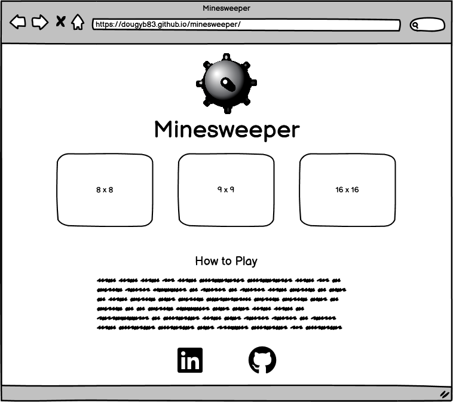
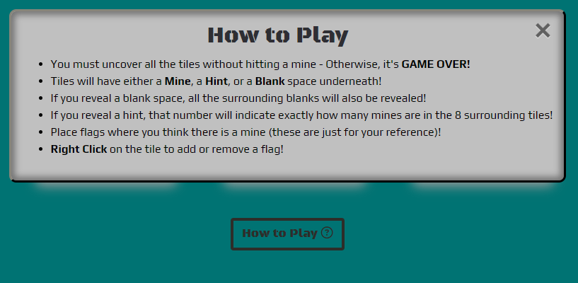
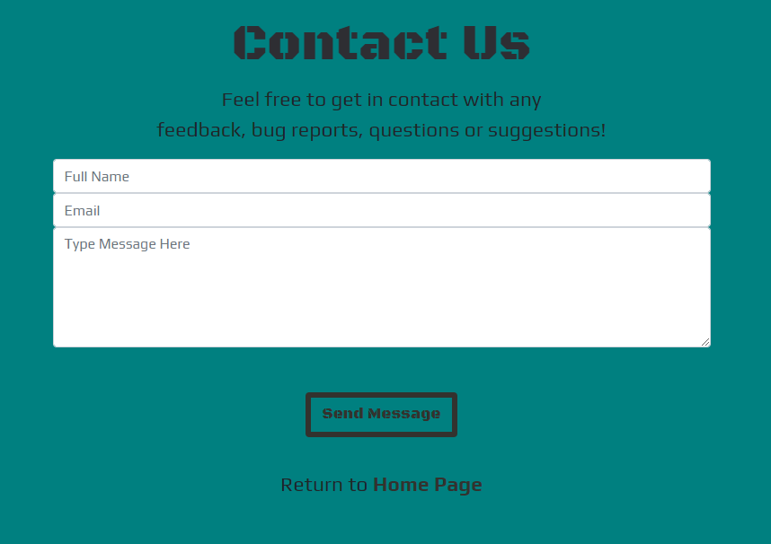

# MINESWEEPER

Minesweeper is a classic puzzle game that challenges players to uncover hidden mines on a grid by strategically revealing tiles.

Our target audience includes both casual gamers looking for a quick mental challenge, puzzle enthusiasts and retro game lovers seeking a nostalgic experience. Whether you're a seasoned minesweeper veteran or a newcomer to the game, our project caters to all skill levels. With its responsive design, the game can be played on a variety of devices, including desktops, laptops, tablets, and mobile phones, making it accessible to players on the go.

The game not only provides entertainment but also serves as a mental exercise, promoting strategic thinking, problem-solving, and pattern recognition skills. Players can compete against themselves by aiming for faster completion times.

In summary, our web-based responsive minesweeper game is designed to appeal to a wide range of players, from casual and retro gamers to puzzle enthusiasts, offering an engaging and accessible experience.

[View the live site here.](https://dougyb83.github.io/minesweeper/)

## UX

As this websites purpose is to provide a gaming experience for the user I have decided to make the home page in the style of a gaming main menu. It will be simple and easy to understand with options provided for different game difficulty levels.

Once the difficulty setting has been selected the appropriate game page will load. The game board will occupy most of the screen on mobile devices while still making navigation buttons and infomation displays available. This will give the user the best gameplay experience while still giving them full navigation.

On desktop and laptop there is more screen real-estate so the game board wwon't fill the screen in the same way but will be more central with space on all four sides. This will be more pleasing to the users eye and will provide a better gameplay experience by keeping the mouse movements within a smaller area.

### Colour Scheme

When selecting the colours for this project I wanted to give the user an authentic Minesweeper experience. The background colour was chosen to match the default wallpaper you would find on Windows 98. While I chose a selection of greys to resemble the original game as found on early Windows machines.

- `#008080` used for background colour.
- `#2E2E33` used for primary text.
- `#33322E` used for primary highlights.
- `#C0C0C0` used for secondary text.
- `#504D4D` used for secondary highlights.
- `#19ad45` used for game 'safe' areas.
- `#E80202` used for game mines.

I used [coolors.co](https://coolors.co/008080-2e2e33-33322e-504d4d-c0c0c0-19ad45-e80202) to generate my colour palette.

### Typography

- [Black Ops One](https://fonts.google.com/specimen/Black+Ops+One) was used for the primary header.
- [Play](https://fonts.google.com/specimen/Play) was used for the secondary header and all other secondary text.
- [Font Awesome](https://fontawesome.com) icons were used throughout the site, such as the game controls and the social media icons in the footer.

## User Stories

### New Site Users

- As a new site user, I would like to easily understand the rules and objective of the game, so that I can start playing without confusion or hesitation.
- As a new site user, I would like to have a responsive design that allows me to play the game on different devices.
- As a new site user, I would like to have clear and intuitive controls, so that I can navigate the game effortlessly.

### Returning Site Users

- As a returning site user, I would like to I would like to choose the difficulty level, so that I can tailor the gameplay experience to my skill level.
- As a returning site user, I would like to see my 'best time' so that i can track my progress.
- As a returning site user, I would like to have the option to customize certain game aspects, such as the sound settings, so that I can tailor the game experience to my preferences.
- As a returning site user, I would like to have access to social media groups dedicated to the game, so that I can interact with other players, share experiences, and discuss strategies.

### Site Admin

- As a site administrator, I should be able to gather user feedback and suggestions, so that I can understand the user's perspective, identify areas for improvement, and enhance the overall user experience.
- As a site administrator, I should be able to communicate with the user community through announcements, newsletters, or notifications, so that I can keep the users informed about important updates, events, or changes in the game.

## Wireframes

To follow best practice, wireframes were developed for mobile, tablet, and desktop sizes.
I've used [Balsamiq](https://balsamiq.com/wireframes) to design my site wireframes.

### Mobile Wireframes

Click here to see the Mobile Wireframes

- Home Page
  - 
- Game Page
  - 
- Contact Page
  - 

### Tablet Wireframes

Click here to see the Tablet Wireframes

- Home Page
  - 
- Game Page
  - 
- Contact Page
  - 

### Desktop Wireframes

Click here to see the Desktop Wireframes

- Home Page
  - 
- Game Page
  - 
- Contact Page
  - 

## Features

The website has three main pages. The homepage and game page are easily accessible between each other by choosing a game difficulty from the homepage or selecting the 'home' icon on the game page, while the contact page is accessible from all pages via the links in the footer. There are an additional two pages; one is a 404 error page, which will be loaded if the user navigates to an invalid address as well as a confirmation page, which loads after the user submits the contact form.

### Existing Features

- **Difficulty selection**

  - There are three possible difficulty options for the user to choose from; Easy, Medium and Expert!
    This gives the user the abilty to increase the difficulty as they become better at the game.
    - Easy - is an 8 x 8 grid with 8 hidden mines.
    - Medium - is a 9 x 9 grid with 10 hidden mines
    - Hard - This level has two grid sizes depending on screen size. on larger screens it is a 16 x 16 grid with 40 hidden mines while smaller screens will have a 12 x 12 grid with 30 hidden mines. This is because it was difficult to select each tile of the larger grid when using a mobile device.

  
- **How to Play Modal**

  - This feature is a pop up modal which gives the user detailed instuctions on how to play the Minesweeper game.
  - It can be accessed on the homepage by selecting the 'How to Play' button beneath the game difficulty buttons or by selecting the question mark icon on the controls bar.
  - When selected The instructions will pop up as an overlay to the pages main content.
  - When the user is finished with the instructions they can easily close the modal. This can be achieved by clicking anywhere on screen, by clicking the 'X' to close button or by hitting 'esc' if playing on a PC/laptop.

  
- **On Screen Display**

  - The On Screen Display lets the user know how many mines are hidden on the game board as well as show them how much time has elapsed since starting the game.
  - The mine display will decrease by one every time a flag is placed and can intentionally go into minus figures. This is a way of letting the user know that they may have incorrectly flagged one or more tiles.
  - The timer displays in seconds and will continue to increase until either the game has been won, lost at which point the timer stops. if the game is reset the time returns to zero.

  
- **Game Won Modal**

  - This is another pop up modal which is only shown when the user has won the game.
  - The modal tells the user how long it took them to finish the game and also shows them their best time.
  - The best time is then stored in local storage so that the user can try to beat it any time they ruturn to the page using the same device and browser.

  
- **Controls Bar**

  - The Controls bar allows the user to return the the homepage, reset the game, view the how to play instrunctions or toggle the game volume on or off.

  
- **The Game Board**

  - The Game board will be a different size depending on whch difficulty the user selects.
  - All tiles are pressable. When pressed, the tile dissappears and reveals what is underneath. This could be a mine, a number hint or a blank space.
  - Any tile that has not been reveald can have a flag placed on it. When a flag is placed that tile cannot be revealed by the user until the flag is removed.

  
- **Contact page**

  - Here the user can contact the site owner with feedback, bug reports, questions or suggestions.
  - The user must fill out all fields with the appropriate information before a message can be sent.
  - When the message is sent the user will be shown a confirmation page.

  
- **Confirmation page**

  - Users are redirected to this page after succesfully sending a message to the site owner.
  - This give the user peice of mind knowing that the message has definately been processed and lets them know that they can expect a reply soon.
  - The page displays a countdown telling the user that they will be taken back to the homepage after 10 seconds.
  - Alternatively the user can select the homepage link if they don't want to wait.

  
- **404 page**

  - This page will be displayed if the user tries to navigate to a page that doesn't exist.
  - The page displays a countdown telling the user that they will be taken back to the homepage after 10 seconds.
  - Alternatively the user can select the homepage link if they don't want to wait.

  
- **Footer**

  - Here users can find links to the pages social media accounts and contact page.
  - This is available on every page.

  

### Future Features

- Custom Game Difficulty
  - I would like to add the abilty for the user to choose a custom grid size as well as a custom amount of mines.
- Leader Board
  - I would like users to be able to compare their times against other users by adding a leaderboard.

## Tools & Technologies Used

- [HTML](https://en.wikipedia.org/wiki/HTML) used for the main site content.
- [CSS](https://en.wikipedia.org/wiki/CSS) used for the main site design and layout.
- [CSS Flexbox](https://www.w3schools.com/css/css3_flexbox.asp) used for an enhanced responsive layout.
- [JavaScript](https://www.javascript.com) used for user interaction on the site.
- [jQuery](https://jquery.com/) also used for user interaction on the site.
- [Git](https://git-scm.com) used for version control. (`git add`, `git commit`, `git push`)
- [GitHub](https://github.com) used for secure online code storage.
- [GitHub Pages](https://pages.github.com) used for hosting the deployed front-end site.
- [Gitpod](https://gitpod.io) used as a cloud-based IDE for development.
- [Bootstrap](https://getbootstrap.com) used as the front-end CSS framework for modern responsiveness and pre-built components.
- [Balsamiq](https://balsamiq.com/) used to create the project wireframes.
- [redketchup](https://redketchup.io/favicon-generator) to generate the favicon used on all pages

## Testing

For all testing, please refer to the [TESTING.md](TESTING.md) file.

## Deployment

The site was deployed to GitHub Pages. The steps to deploy are as follows:

- In the [GitHub repository](https://github.com/dougyb83/minesweeper), navigate to the Settings tab
- Under the heading "Code and automation", select "Pages".
- From the source section drop-down menu, select the Main Branch, then click "Save".
- The page will be automatically refreshed with a detailed ribbon display to indicate the successful deployment.

The live link can be found [here](https://dougyb83.github.io/minesweeper)

### Local Deployment

This project can be cloned or forked in order to make a local copy on your own system.

#### Cloning

You can clone the repository by following these steps:

1. Go to the [GitHub repository](https://github.com/dougyb83/minesweeper)
2. Locate the Code button above the list of files and click it
3. Select if you prefer to clone using HTTPS, SSH, or GitHub CLI and click the copy button to copy the URL to your clipboard
4. Open Git Bash or Terminal
5. Change the current working directory to the one where you want the cloned directory
6. In your IDE Terminal, type the following command to clone my repository:
   - `git clone https://github.com/dougyb83/minesweeper.git`
7. Press Enter to create your local clone.

Alternatively, if using Gitpod, you can click below to create your own workspace using this repository.

Please note that in order to directly open the project in Gitpod, you need to have the browser extension installed.
A tutorial on how to do that can be found [here](https://www.gitpod.io/docs/configure/user-settings/browser-extension).

#### Forking

By forking the GitHub Repository, we make a copy of the original repository on our GitHub account to view and/or make changes without affecting the original owner's repository.
You can fork this repository by using the following steps:

1. Log in to GitHub and locate the [GitHub Repository](https://github.com/dougyb83/minesweeper)
2. At the top right of the repository but below the navbar, locate the "Fork" button.
3. Once clicked, you should now have a copy of the original repository in your own GitHub account!

### Local VS Deployment

⚠️⚠️⚠️⚠️⚠️ START OF NOTES (to be deleted) ⚠️⚠️⚠️⚠️⚠️

Use this space to discuss any differences between the local version you've developed, and the live deployment site on GitHub Pages.

🛑🛑🛑🛑🛑 END OF NOTES (to be deleted) 🛑🛑🛑🛑🛑

## Credits

### Content

| Source                                                                | Location           | Notes                                         |
| --------------------------------------------------------------------- | ------------------ | --------------------------------------------- |
| [Markdown Builder](https://traveltimn.github.io/markdown-builder)        | README and TESTING | tool to help generate the Markdown files      |
| [Chris Beams](https://chris.beams.io/posts/git-commit)                   | version control    | "How to Write a Git Commit Message"           |
| [W3Schools](https://www.w3schools.com/jsref/default.asp)                 | entire site        | to reference to all JavaScript methods        |
| [Flexbox Froggy](https://flexboxfroggy.com/)                             | entire site        | modern responsive layouts                     |
| [YouTube](https://youtu.be/LFU5ZlrR21E)                                  | game page          | Use of a 2D array to create the game grid     |
| [YouTube](https://www.youtube.com/watch?v=YL1F4dCUlLc&ab_channel=WesBos) | home & game page   | use of local storage to store variable data   |
| [linuxhint](https://linuxhint.com/javascript-count-up-timer/)            | game page          | how to create a timer with 1 second intervals |
| [StackOverflow](https://stackoverflow.com/a/7715161)                     | home page          | how to query screensize                       |
| [StackOverflow](https://stackoverflow.com/a/48088202)                    | home & game page   | X to close button on modal                    |
| [StackOverflow](https://stackoverflow.com/a/36018502)                    | game page          | time delay on mine reveal                     |
| [StackOverflow](https://stackoverflow.com/a/25654697)                    | game page          | to play multiple sounds at once               |
| [StackOverflow](https://stackoverflow.com/a/4236294)                     | game page          | how to add event listener for right click     |
| [StackOverflow](https://stackoverflow.com/a/16987577)                    | game page          | how to stop the default action of right click |
| [StackOverflow](https://stackoverflow.com/a/66361691)                    | game page          | how to get a random index from a 2d array     |
| [Font Awesome](https://fontawesome.com/)                                 | entire site        | for icons on socials and controls bar         |

### Media

| Source                                                                     | Location    | Type  | Notes                     |
| -------------------------------------------------------------------------- | ----------- | ----- | ------------------------- |
| [pngegg](https://www.pngegg.com/en/png-cbukd)                                 | entire site | image | Mine logo                 |
| [opengameart](https://opengameart.org/content/short-impact)                   | game page   | sound | Mine exploding            |
| [opengameart](https://opengameart.org/content/sci-fi-openclose-interface-sfx) | game page   | sound | Adding and removing flags |
| [99sounds](https://99sounds.org/free-sound-effects/)                          | game page   | sound | Tile reveal               |

### Acknowledgements

- I would like to thank my Code Institute mentor, [Tim Nelson](https://github.com/TravelTimN) for their support throughout the development of this project.
- I would like to thank the [Code Institute](https://codeinstitute.net) tutor team for their assistance with troubleshooting and debugging some project issues.
