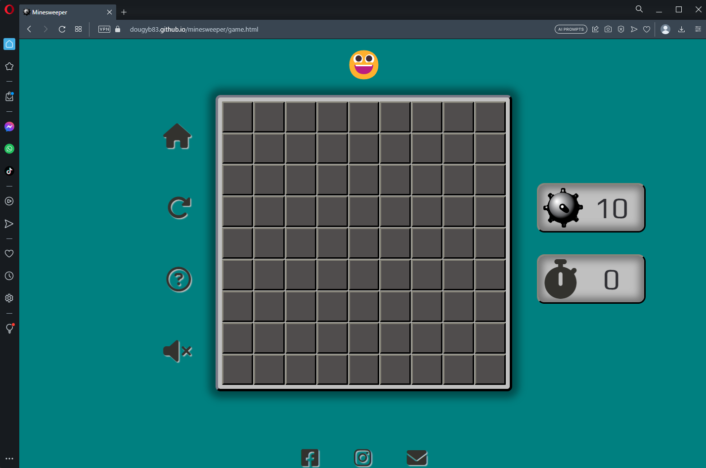
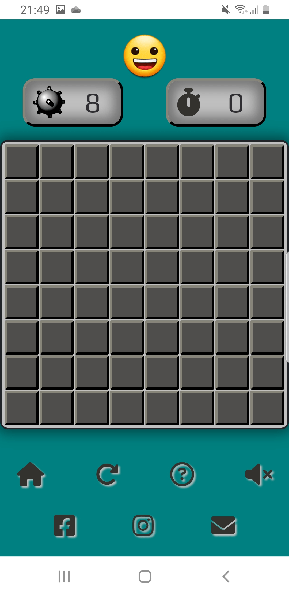

# Testing

Return back to the [README.md](README.md) file.

## Code Validation

### HTML

I have used the recommended [HTML W3C Validator](https://validator.w3.org) to validate all of my HTML files.

| Page         | W3C URL                                                                                                 | Screenshot                                                             | Notes                                                   |
| ------------ | ------------------------------------------------------------------------------------------------------- | ---------------------------------------------------------------------- | ------------------------------------------------------- |
| Home         | [W3C](https://validator.w3.org/nu/?doc=https%3A%2F%2Fdougyb83.github.io%2Fminesweeper%2Findex.html)        |          | misuse of aria-label warning                            |
| Game         | [W3C](https://validator.w3.org/nu/?doc=https%3A%2F%2Fdougyb83.github.io%2Fminesweeper%2Fgame.html)         |          | misuse of aria-label and section lacks heading warnings |
| Contact      | [W3C](https://validator.w3.org/nu/?doc=https%3A%2F%2Fdougyb83.github.io%2Fminesweeper%2Fcontact.html)      |       | Pass: No Errors                                         |
| Confirmation | [W3C](https://validator.w3.org/nu/?doc=https%3A%2F%2Fdougyb83.github.io%2Fminesweeper%2Fconfirmation.html) |  | Pass: No Errors                                         |
| 404          | [W3C](https://validator.w3.org/nu/?doc=https%3A%2F%2Fdougyb83.github.io%2Fminesweeper%2F404.html)          |           | Pass: No Errors                                         |

### CSS

I have used the recommended [CSS Jigsaw Validator](https://jigsaw.w3.org/css-validator) to validate all of my CSS files.

| File         | Jigsaw URL                                                                                              | Screenshot                                             | Notes                              |
| ------------ | ------------------------------------------------------------------------------------------------------- | ------------------------------------------------------ | ---------------------------------- |
| style.css    | [Jigsaw](https://jigsaw.w3.org/css-validator/validator?uri=https://dougyb83.github.io/minesweeper) |     | Pass: No Errors  |

### JavaScript

I have used the recommended [JShint Validator](https://jshint.com) to validate all of my JS files.

| File               | Screenshot                                             | Notes                                |
| ------------------ | ------------------------------------------------------ | ------------------------------------ |
| index.js          |     | Pass: No Errors |
| game.js       |  | Pass: No Errors (the unused variable is a function created for testing purposes)                     |


## Browser Compatibility

I've tested my deployed project on multiple browsers to check for compatibility issues.

| Browser           | Screenshot                                     | Screenshot                                     | Screenshot                                     | Notes                                |
| ----------------- | ---------------------------------------------- | ---------------------------------------------- | ---------------------------------------------- | ------------------------------------ |
| Chrome            |   |   |   | Works as expected                    |
| Firefox           |  |   |   | Minor CSS differences                    |
| Edge              |     |   |   | Works as expected                    |
| Aloha            |   |   |   | Works as expecteds                |
| Brave             |    |   |   | Works as expected                    |
| Opera             |    |   |   | Works as expected                   |


## Responsiveness

I've tested my deployed project on multiple devices to check for responsiveness issues.

| Device                   | Screenshot                                                          | Screenshot                                                           | Screenshot                                                         | Notes             |
| ------------------------ | ------------------------------------------------------------------- | -------------------------------------------------------------------- | ------------------------------------------------------------------ | ----------------- |
| Mobile (DevTools)        |    |    |    | Works as expected |
| Tablet (DevTools)        |    |    |    | Works as expected |
| Desktop                  |       |       |       | Works as expected |
| Google Pixel 4a          |  |  |  | Works as expected |
| Samsung Galaxy S8        |     |     |     | Works as expected |
| Samsung Galaxy S21 Ultra |    |    |    | Works as expected |
| Samsung Galaxy tab 4     |   |   |   | Works as expected |

## Lighthouse Audit

I've tested my deployed project using the Lighthouse Audit tool to check for any major issues.

| Page    | Size    | Screenshot                                                | Notes                                   |
| ------- | ------- | --------------------------------------------------------- | --------------------------------------- |
| Home    | Mobile  |      | Some minor warnings                     |
| Home    | Desktop |     | Some minor warnings                            |
| Game   | Mobile  |     | Some minor warnings                     |
| Game   | Desktop |    | Some minor warnings                           |
| Contact | Mobile  |   | No major problems  |
| Contact | Desktop |  | No major problems  |


## Defensive Programming

Defensive programming was manually tested with the below user acceptance testing:

| Page | User Action | Expected Result | Pass/Fail | Comments |
| --- | --- | --- | --- | --- |
| Home Page | | | | |
| | Click on Easy button | Redirection to Game page | Pass | |
| | Click on Medium button | Redirection to Game page | Pass | |
| | Click on Expert button | Redirection to Game page | Pass | |
| | Click on How to Play button | Modal popup | Pass | |
| | Click on Modal 'X' | Closes Modal | Pass | |
| | Click on Facebook logo | New windows opens Facebook website | Pass | |
| | Click on Instagram logo | New windows opens Instagram website | Pass | |
| | Click on Envelope logo | Redirection to Contact page | Pass | |
| Game Page | | | | |
| | Click on Home logo | Redirection to Home page | Pass | |
| | Click on Arrow logo | Resets the game | Pass | |
| | Click on Question mark logo | Modal popup | Pass | |
| | Click on Modal 'X' | Closes Modal | Pass | |
| | Click on Speaker logo | Unmutes or mutes game sounds | Pass | |
| | Click on Smiley emoji | Resets the game | Pass | |
| | Click on Facebook logo | New windows opens Facebook website | Pass | |
| | Click on Instagram logo | New windows opens Instagram website | Pass | |
| | Click on Envelope logo | Redirection to Contact page | Pass | |
| | Left Click on a Tile | Uncovers one or more tiles, revealing a number, a blank space or a mines | Pass | |
| | Right Click on a Tile | Places a flag and disables Left Click | Pass | |
| | Right Click on a Flagged Tile | Remove the flag and enables Left Click | Pass | |
| Contact Page | | | | |
| | Enter first/last name | Field will accept freeform text | Pass | |
| | Enter valid email address | Field will only accept email address format | Pass | |
| | Enter message in textarea | Field will accept freeform text | Pass | |
| | Click the Send Mesage button | Redirects user to Confirmation page | Pass | |
| | Click the Home Page link | Redirects to Home page | Pass | |
| | Click on Facebook logo | New windows opens Facebook website | Pass | |
| | Click on Instagram logo | New windows opens Instagram website | Pass | |
| | Click on Envelope logo | Redirection to Contact page | Pass | |

## User Story Testing

| User Story                                                                             | Screenshot                               |
| -------------------------------------------------------------------------------------- | ---------------------------------------- |
| As a new site user, I would like to easily understand the rules and objective of the game, so that I can start playing without confusion or hesitation. |  |
| As a new site user, I would like to have a responsive design that allows me to play the game on different devices. |  |
| As a new site user, I would like to have clear and intuitive controls, so that I can navigate the game effortlessly. |  |
| As a returning site user, I would like to I would like to choose the difficulty level, so that I can tailor the gameplay experience to my skill level. |  |
| As a returning site user, I would like to see my 'best time' so that i can track my progress. |  |
| As a returning site user, I would like to have the option to customize certain game aspects, such as the sound settings, so that I can tailor the game experience to my preferences. |  |
| As a returning site user, I would like to have access to social media groups dedicated to the game, so that I can interact with other players, share experiences, and discuss strategies. |  |
| As a site administrator, I should be able to gather user feedback and suggestions, so that I can understand the user's perspective, identify areas for improvement, and enhance the overall user experience. |  |
| As a site administrator, I should be able to communicate with the user community through announcements, newsletters, or notifications, so that I can keep the users informed about important updates, events, or changes in the game. |  |  

## Automated Testing

I have conducted a series of automated tests on my application.

I fully acknowledge and understand that, in a real-world scenario, an extensive set of additional tests would be more comprehensive.

### JavaScript (Jest Testing)

⚠️⚠️⚠️⚠️⚠️ START OF NOTES (to be deleted) ⚠️⚠️⚠️⚠️⚠️

Adjust the code below (file names, etc.) to match your own project files/folders.

🛑🛑🛑🛑🛑 END OF NOTES (to be deleted) 🛑🛑🛑🛑🛑

I have used the [Jest](https://jestjs.io) JavaScript testing framework to test the application functionality.

In order to work with Jest, I first had to initialize NPM.

- `npm init`
- Hit `enter` for all options, except for **test command:**, just type `jest`.

Add Jest to a list called **Dev Dependencies** in a dev environment:

- `npm install --save-dev jest`

**IMPORTANT**: Initial configurations

When creating test files, the name of the file needs to be `file-name.test.js` in order for Jest to properly work.

Due to a change in Jest's default configuration, you'll need to add the following code to the top of the `.test.js` file:

```js
/**
 * @jest-environment jsdom
 */

const { test, expect } = require("@jest/globals");
const { function1, function2, function3, etc. } = require("../script-name");

beforeAll(() => {
    let fs = require("fs");
    let fileContents = fs.readFileSync("index.html", "utf-8");
    document.open();
    document.write(fileContents);
    document.close();
});
```

Remember to adjust the `fs.readFileSync()` to the specific file you'd like you test.
The example above is testing the `index.html` file.

Finally, at the bottom of the script file where your primary scripts are written, include the following at the bottom of the file.
Make sure to include the name of all of your functions that are being tested in the `.test.js` file.

```js
if (typeof module !== "undefined") module.exports = {
    function1, function2, function3, etc.
};
```

Now that these steps have been undertaken, further tests can be written, and be expected to fail initially.
Write JS code that can get the tests to pass as part of the Red-Green refactor process.

Once ready, to run the tests, use this command:

- `npm test`

**NOTE**: To obtain a coverage report, use the following command:

- `npm test --coverage`

Below are the results from the tests that I've written for this application:

| Test Suites | Tests     | Coverage | Screenshot                                      |
| ----------- | --------- | -------- | ----------------------------------------------- |
| 1 passed    | 16 passed | 55%      |  |
| x           | x         | x        | repeat for all remaining tests                  |

#### Jest Test Issues

⚠️⚠️⚠️⚠️⚠️ START OF NOTES (to be deleted) ⚠️⚠️⚠️⚠️⚠️

Use this section to list any known issues you ran into while writing your Jest tests.
Remember to include screenshots (where possible), and a solution to the issue (if known).

This can be used for both "fixed" and "unresolved" issues.

🛑🛑🛑🛑🛑 END OF NOTES (to be deleted) 🛑🛑🛑🛑🛑

## Bugs

⚠️⚠️⚠️⚠️⚠️ START OF NOTES (to be deleted) ⚠️⚠️⚠️⚠️⚠️

It's very important to document any bugs you've discovered while developing the project.
Make sure to include any necessary steps you've implemented to fix the bug(s) as well.

For JavaScript and Python applications, it's best to screenshot the errors to include them as well.

**PRO TIP**: screenshots of bugs are extremely helpful, and go a long way!

🛑🛑🛑🛑🛑 END OF NOTES (to be deleted) 🛑🛑🛑🛑🛑

- JS Uncaught ReferenceError: `foobar` is undefined/not defined

  

  - To fix this, I _____________________.
- JS `'let'` or `'const'` or `'template literal syntax'` or `'arrow function syntax (=>)'` is available in ES6 (use `'esversion: 11'`) or Mozilla JS extensions (use moz).

  

  - To fix this, I _____________________.
- Python `'ModuleNotFoundError'` when trying to import module from imported package

  

  - To fix this, I _____________________.
- Django `TemplateDoesNotExist` at /appname/path appname/template_name.html

  

  - To fix this, I _____________________.
- Python `E501 line too long` (93 > 79 characters)

  

  - To fix this, I _____________________.

### GitHub **Issues**

⚠️⚠️⚠️⚠️⚠️ START OF NOTES (to be deleted) ⚠️⚠️⚠️⚠️⚠️

An improved way to manage bugs is to use the built-in **Issues** tracker on your GitHub repository.
To access your Issues, click on the "Issues" tab at the top of your repository.
Alternatively, use this link: https://github.com/dougyb83/minesweeper/issues

If using the Issues tracker for your bug management, you can simplify the documentation process.
Issues allow you to directly paste screenshots into the issue without having to first save the screenshot locally,
then uploading into your project.

You can add labels to your issues (`bug`), assign yourself as the owner, and add comments/updates as you progress with fixing the issue(s).

Once you've sorted the issue, you should then "Close" it.

When showcasing your bug tracking for assessment, you can use the following format:

🛑🛑🛑🛑🛑 END OF NOTES (to be deleted) 🛑🛑🛑🛑🛑

**Fixed Bugs**

All previously closed/fixed bugs can be tracked [here](https://github.com/dougyb83/minesweeper/issues?q=is%3Aissue+is%3Aclosed).

| Bug                                                                                                                                  | Status |
| ------------------------------------------------------------------------------------------------------------------------------------ | ------ |
| [JS Uncaught ReferenceError: `foobar` is undefined/not defined](https://github.com/dougyb83/minesweeper/issues/1)                     | Closed |
| [Python `'ModuleNotFoundError'` when trying to import module from imported package](https://github.com/dougyb83/minesweeper/issues/2) | Closed |
| [Django `TemplateDoesNotExist` at /appname/path appname/template_name.html](https://github.com/dougyb83/minesweeper/issues/3)         | Closed |

**Open Issues**

Any remaining open issues can be tracked [here](https://github.com/dougyb83/minesweeper/issues).

| Bug                                                                                                                                                                                                                                 | Status |
| ----------------------------------------------------------------------------------------------------------------------------------------------------------------------------------------------------------------------------------- | ------ |
| [JS `'let'` or `'const'` or `'template literal syntax'` or `'arrow function syntax (=>)'` is available in ES6 (use `'esversion: 11'`) or Mozilla JS extensions (use moz).](https://github.com/dougyb83/minesweeper/issues/4) | Open   |
| [Python `E501 line too long` (93 &gt; 79 characters)](https://github.com/dougyb83/minesweeper/issues/5)                                                                                                                              | Open   |

## Unfixed Bugs

⚠️⚠️⚠️⚠️⚠️ START OF NOTES (to be deleted) ⚠️⚠️⚠️⚠️⚠️

You will need to mention unfixed bugs and why they were not fixed.
This section should include shortcomings of the frameworks or technologies used.
Although time can be a big variable to consider, paucity of time and difficulty understanding
implementation is not a valid reason to leave bugs unfixed.

If you've identified any unfixed bugs, no matter how small, be sure to list them here.
It's better to be honest and list them, because if it's not documented and an assessor finds the issue,
they need to know whether or not you're aware of them as well, and why you've not corrected/fixed them.

Some examples:

🛑🛑🛑🛑🛑 END OF NOTES (to be deleted) 🛑🛑🛑🛑🛑

- On devices smaller than 375px, the page starts to have `overflow-x` scrolling.

  

  - Attempted fix: I tried to add additional media queries to handle this, but things started becoming too small to read.
- For PP3, when using a helper `clear()` function, any text above the height of the terminal does not clear, and remains when you scroll up.

  

  - Attempted fix: I tried to adjust the terminal size, but it only resizes the actual terminal, not the allowable area for text.
- When validating HTML with a semantic `section` element, the validator warns about lacking a header `h2-h6`. This is acceptable.

  

  - Attempted fix: this is a known warning and acceptable, and my section doesn't require a header since it's dynamically added via JS.

⚠️⚠️⚠️⚠️⚠️ START OF NOTES (to be deleted) ⚠️⚠️⚠️⚠️⚠️

If you legitimately cannot find any unfixed bugs or warnings, then use the following sentence:

🛑🛑🛑🛑🛑 END OF NOTES (to be deleted) 🛑🛑🛑🛑🛑

There are no remaining bugs that I am aware of.
