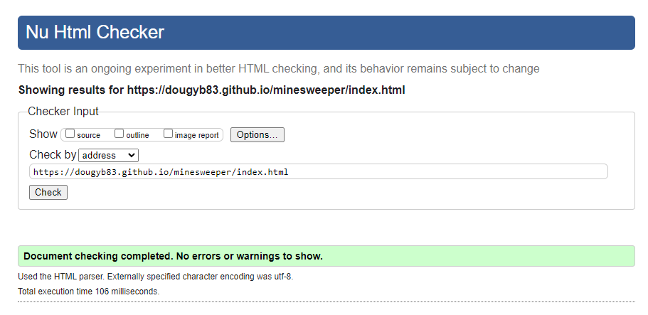
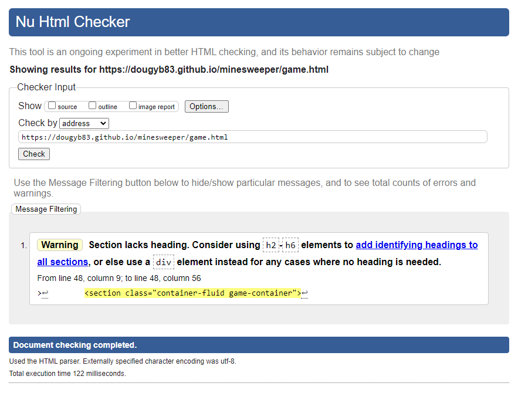
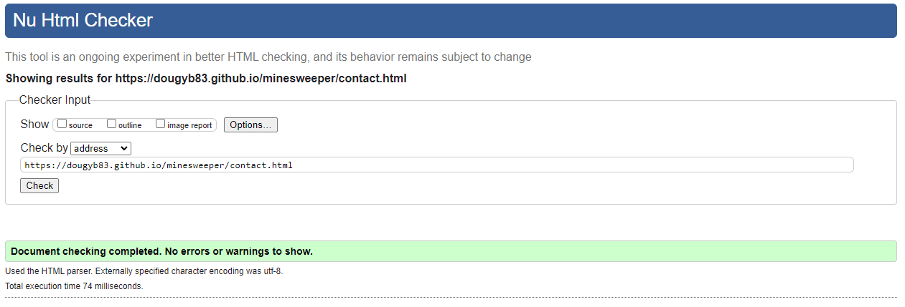
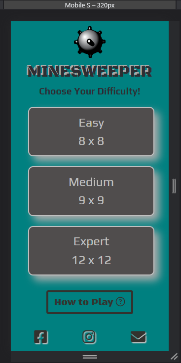
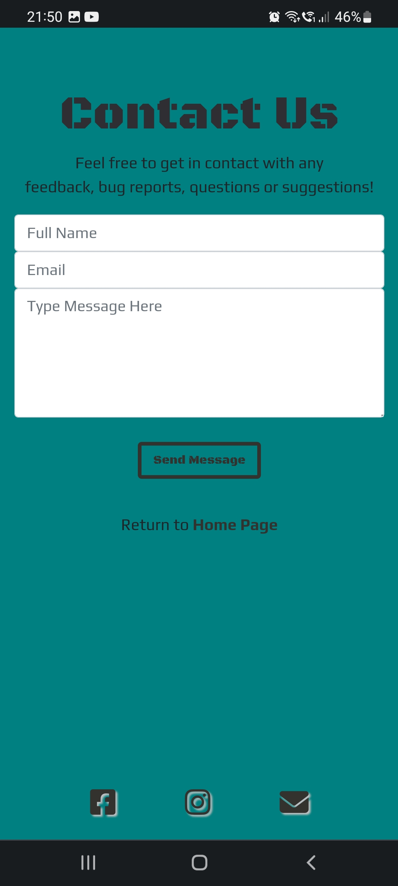
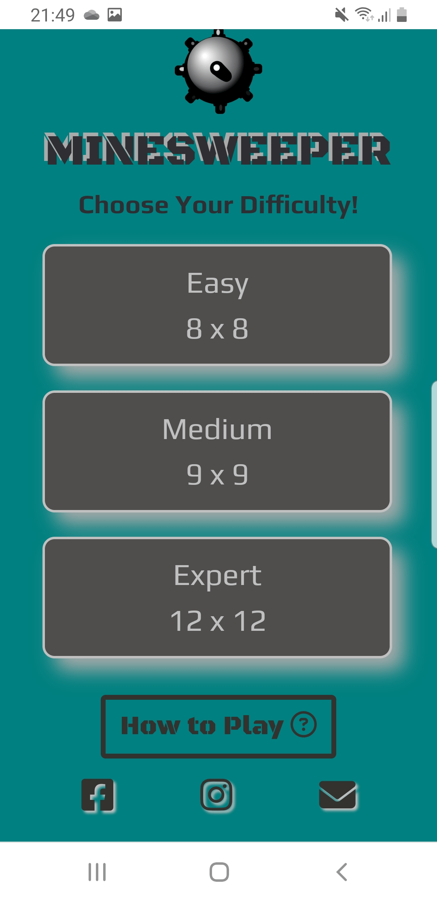
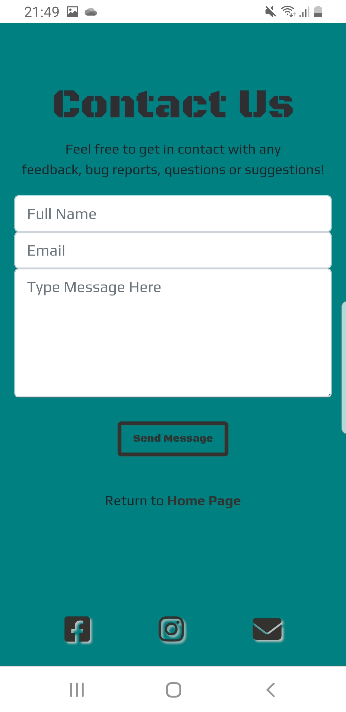
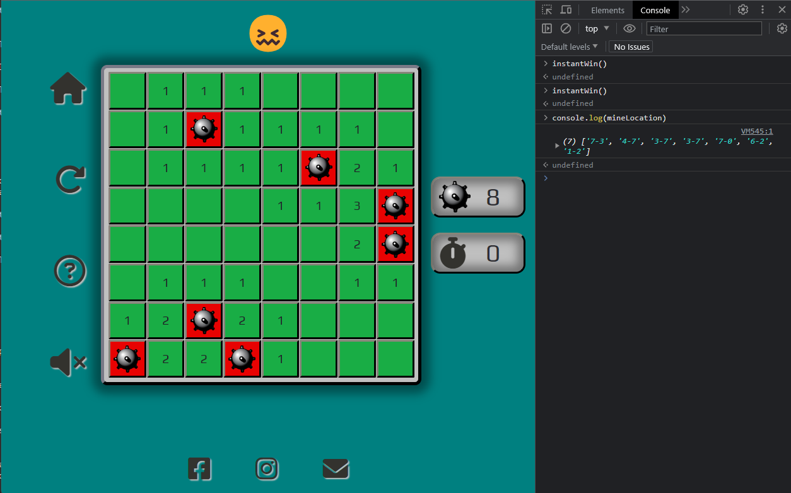

# Testing

Return back to the [README.md](README.md) file.

## Code Validation

### HTML

I have used the recommended [HTML W3C Validator](https://validator.w3.org) to validate all of my HTML files.

| Page         | W3C URL                                                                                                 | Screenshot                                                             | Notes                               |
| ------------ | ------------------------------------------------------------------------------------------------------- | ---------------------------------------------------------------------- | ----------------------------------- |
| Home         | [W3C](https://validator.w3.org/nu/?doc=https%3A%2F%2Fdougyb83.github.io%2Fminesweeper%2Findex.html)        |          | Pass: No Errors                     |
| Game         | [W3C](https://validator.w3.org/nu/?doc=https%3A%2F%2Fdougyb83.github.io%2Fminesweeper%2Fgame.html)         |          | Section lacks heading h2-h6 warning |
| Contact      | [W3C](https://validator.w3.org/nu/?doc=https%3A%2F%2Fdougyb83.github.io%2Fminesweeper%2Fcontact.html)      |       | Pass: No Errors                     |
| Confirmation | [W3C](https://validator.w3.org/nu/?doc=https%3A%2F%2Fdougyb83.github.io%2Fminesweeper%2Fconfirmation.html) |  | Pass: No Errors                     |
| 404          | [W3C](https://validator.w3.org/nu/?doc=https%3A%2F%2Fdougyb83.github.io%2Fminesweeper%2F404.html)          |           | Pass: No Errors                     |

### CSS

I have used the recommended [CSS Jigsaw Validator](https://jigsaw.w3.org/css-validator) to validate all of my CSS files.

| File      | Jigsaw URL                                                                                      | Screenshot                                                     | Notes           |
| --------- | ----------------------------------------------------------------------------------------------- | -------------------------------------------------------------- | --------------- |
| style.css | [Jigsaw](https://jigsaw.w3.org/css-validator/validator?uri=https://dougyb83.github.io/minesweeper) |  | Pass: No Errors |

### JavaScript

I have used the recommended [JShint Validator](https://jshint.com) to validate all of my JS files.

| File          | Screenshot                                                         | Notes                                                            |
| ------------- | ------------------------------------------------------------------ | ---------------------------------------------------------------- |
| index.js      |       | Pass: No Errors                                                  |
| game.js       |        | Pass: No Errors (instantWin and module are for testing purposes) |
| index.test.js |  | Pass: No Errors                                                  |
| game.test.js  |   | Pass: No Errors                                                  |
| setup-jest.js |  | Pass: No Errors                                                  |

## Browser Compatibility

I've tested my deployed project on multiple browsers to check for compatibility issues.

| Browser | Screenshot                                                                | Screenshot                                                                | Screenshot                                                                   | Notes                 |
| ------- | ------------------------------------------------------------------------- | ------------------------------------------------------------------------- | ---------------------------------------------------------------------------- | --------------------- |
| Chrome  |   |   |   | Works as expected     |
| Firefox |  |  |  | Minor CSS differences |
| Edge    |     |     |     | Works as expected     |
| Aloha   |    |    |    | Works as expecteds    |
| Brave   |    |    |    | Works as expected     |
| Opera   |    |    |    | Works as expected     |

## Responsiveness

I've tested my deployed project on multiple devices to check for responsiveness issues.

| Device                   | Screenshot                                                          | Screenshot                                                          | Screenshot                                                             | Notes             |
| ------------------------ | ------------------------------------------------------------------- | ------------------------------------------------------------------- | ---------------------------------------------------------------------- | ----------------- |
| Mobile (DevTools)        |    |    |    | Works as expected |
| Tablet (DevTools)        |    |    |    | Works as expected |
| Desktop                  |       |       |       | Works as expected |
| Google Pixel 4a          |  |  |  | Works as expected |
| Samsung Galaxy S8        |     |     |     | Works as expected |
| Samsung Galaxy S21 Ultra |    |    |    | Works as expected |
| Samsung Galaxy tab 4     |   |   |   | Works as expected |

## Lighthouse Audit

I've tested my deployed project using the Lighthouse Audit tool to check for any major issues.

| Page    | Size    | Screenshot                                                           | Notes               |
| ------- | ------- | -------------------------------------------------------------------- | ------------------- |
| Home    | Mobile  |      | Some minor warnings |
| Home    | Desktop |     | Some minor warnings |
| Game    | Mobile  |      | Some minor warnings |
| Game    | Desktop |     | Some minor warnings |
| Contact | Mobile  |   | No major problems   |
| Contact | Desktop |  | No major problems   |

## Defensive Programming

Defensive programming was manually tested with the below user acceptance testing:

| Page         | User Action                   | Expected Result                                                                | Pass/Fail | Comments |
| ------------ | ----------------------------- | ------------------------------------------------------------------------------ | --------- | -------- |
| Home Page    |                               |                                                                                |           |          |
|              | Click on Easy button          | Redirection to Game page 8 x 8 grid                                            | Pass      |          |
|              | Click on Medium button        | Redirection to Game page 9 x 9 grid                                            | Pass      |          |
|              | Click on Expert button        | Redirection to Game page 16 x 16 grid or 12 x 12 grid depending on screen size | Pass      |          |
|              | Click on How to Play button   | Modal popup                                                                    | Pass      |          |
|              | Click on Modal 'X'            | Closes Modal                                                                   | Pass      |          |
|              | Click on Facebook logo        | Facebook website opens in a new tab                                                | Pass      |          |
|              | Click on Instagram logo       | Instagram website opens in a new tab                                                | Pass      |          |
|              | Click on Envelope logo        | Redirection to Contact page                                                    | Pass      |          |
| Game Page    |                               |                                                                                |           |          |
|              | Click on Home logo            | Redirection to Home page                                                       | Pass      |          |
|              | Click on Arrow logo           | Resets the game                                                                | Pass      |          |
|              | Click on Question mark logo   | Modal popup                                                                    | Pass      |          |
|              | Click on Modal 'X'            | Closes Modal                                                                   | Pass      |          |
|              | Click on Speaker logo         | Unmutes or mutes game sounds                                                   | Pass      |          |
|              | Click on Smiley emoji         | Resets the game                                                                | Pass      |          |
|              | Click on Facebook logo        | Facebook website opens in a new tab                                            | Pass      |          |
|              | Click on Instagram logo       | Instagram website opens in a new tab                                           | Pass      |          |
|              | Click on Envelope logo        | Redirection to Contact page                                                    | Pass      |          |
|              | Left Click on a Tile          | Uncovers one or more tiles, revealing a number, a blank space or a mine       | Pass      |          |
|              | Right Click on a Tile         | Places a flag and disables Left Click                                          | Pass      |          |
|              | Right Click on a Flagged Tile | Remove the flag and enables Left Click                                         | Pass      |          |
| Contact Page |                               |                                                                                |           |          |
|              | Enter first/last name         | Field will accept freeform text                                                | Pass      |          |
|              | Enter valid email address     | Field will only accept email address format                                    | Pass      |          |
|              | Enter message in textarea     | Field will accept freeform text                                                | Pass      |          |
|              | Click the Send Message button  | Redirects user to Confirmation page                                            | Pass      |          |
|              | Click the Send Message button with empty form  | Forces user to enter required fields                                            | Pass      |          |
|              | Click the Home Page link      | Redirects to Home page                                                         | Pass      |          |
|              | Click on Facebook logo        | Facebook website opens in a new tab                                                | Pass      |          |
|              | Click on Instagram logo       | Instagram website opens in a new tab                                                | Pass      |          |
|              | Click on Envelope logo        | Redirection to Contact page                                                    | Pass      |          |

## User Story Testing

| User Story                                                                                                                                                                                                                            | Screenshot                                        |
| ------------------------------------------------------------------------------------------------------------------------------------------------------------------------------------------------------------------------------------- | ------------------------------------------------- |
| As a new site user, I would like to easily understand the rules and objective of the game, so that I can start playing without confusion or hesitation.                                                                               |  |
| As a new site user, I would like to have a responsive design that allows me to play the game on different devices.                                                                                                                    |  |
| As a new site user, I would like to have clear and intuitive controls, so that I can navigate the game effortlessly.                                                                                                                  |  |
| As a returning site user, I would like to I would like to choose the difficulty level, so that I can tailor the gameplay experience to my skill level.                                                                                |  |
| As a returning site user, I would like to see my 'best time' so that i can track my progress.                                                                                                                                         |  |
| As a returning site user, I would like to have the option to customize certain game aspects, such as the sound settings, so that I can tailor the game experience to my preferences.                                                  |  |
| As a returning site user, I would like to have access to social media groups dedicated to the game, so that I can interact with other players, share experiences, and discuss strategies.                                             |  |
| As a site administrator, I should be able to gather user feedback and suggestions, so that I can understand the user's perspective, identify areas for improvement, and enhance the overall user experience.                          |  |
| As a site administrator, I should be able to communicate with the user community through announcements, newsletters, or notifications, so that I can keep the users informed about important updates, events, or changes in the game. |  |

## Automated Testing

I have conducted a series of automated tests on my application.

I fully acknowledge and understand that, in a real-world scenario, an extensive set of additional tests would be more comprehensive.

### JavaScript (Jest Testing)

I have used the [Jest](https://jestjs.io) JavaScript testing framework to test the application functionality.

In order to work with Jest, I first had to initialize NPM.

- `npm init`
- Hit `enter` for all options, except for **test command:**, just type `jest`.

Add Jest to a list called **Dev Dependencies** in a dev environment:

- `npm install --save-dev jest`

**IMPORTANT**: Initial configurations

When creating test files, the name of the file needs to be `file-name.test.js` in order for Jest to properly work.

Due to a change in Jest's default configuration, you'll need to add the following code to the top of the `.test.js` file:

```js
/**
 * @jest-environment jsdom
 */

const { test, expect } = require("@jest/globals");

let function1;
let function2;
let function3;

beforeAll(() => {
    let fs = require("fs");
    let fileContents = fs.readFileSync("game.html", "utf-8");
    document.open();
    document.write(fileContents);
    function1 = require('../scrpt-name.js').function1;
    function2 = require('../scrpt-name.js').function2;
    function3 = require('../scrpt-name.js').function3;
    document.close();
});
```

Remember to adjust the `fs.readFileSync()` to the specific file you'd like you test.
The example above is testing the `game.html` file.

Finally, at the bottom of the script file where your primary scripts are written, include the following at the bottom of the file.
Make sure to include the name of all of your functions that are being tested in the `.test.js` file.

```js
if (typeof module !== "undefined") module.exports = {
    function1, function2, function3, etc.
};
```

Now that these steps have been undertaken, further tests can be written, and be expected to fail initially.
Write JS code that can get the tests to pass as part of the Red-Green refactor process.

Once ready, to run the tests, use this command:

- `npm test`

**NOTE**: To obtain a coverage report, use the following command:

- `npm test --coverage`

Below are the results from the tests that I've written for this application:

| Test Suites | Tests     | Screenshot                                      |
| ----------- | --------- | ----------------------------------------------- |
| 2 passed    | 14 passed |  |


#### Jest Test Issues

- TypeError when running jest tests
  

  - When requiring functions and variables in the way that has been taught: `const { function1, function2, function3, etc. } = require("../script-name");` I was experiencing errors with the event listeners that were outside of the `document.addEventListener("DOMContentLoaded", function () {  }` block. After moving these lines within the block I recieved further errors, as follows:
  
  
  - With Tutor supports help it was found that it was necessary to require each function individually from within the `beforeAll()` block. As demonstrated above in the initial configurations above.

- ReferenceError when running jest tests
  

  - Jest would not recognise the Jquery `$` reference. 
  - A solution was found on [StackOverflow](https://stackoverflow.com/a/72273012). It was necessary to create a setup file with `const $ = require('jquery');` and `global.$ = global.jQuery = $;` in it and then to reference that file within package.json configuration.

## Bugs

- JS Uncaught RangeError: Maximum call stack size exceeded

  

  - This was caused after clicking a tile that contained a blank space. When a blank space is found the `checkSurroundingTiles()` function then searches the 8 tiles around the clicked tile. Any of those 8 subsequent tiles found to also be blank then have the same logic passed on them. This created an infinite loop because once a blank was found and revealed there was no logic in place to stop the function checking the same tiles again.
  - To fix this, I added a class of 'clicked' to every tile div that had been either clicked by the user or revealed by the function. Then adding this line of code `if (tile.classList.contains("clicked")) {   return;   }` to the `checkTile()` function which ends the search if the tile has this class.
- Last square on the board grid was not forming correctly.

  
  

  - To fix this, I used dev tools to discover that the last div was not having the width and height attributes applied to it (pictured). I then found that one of my jQuery statements was trying to apply the attributes to the div before the div was actually created.
  - To fix this, I simply moved the jQuery statement to the end of the `createGrid()` function and after the creation of the div.
- Incorrect quantity of mines being generated.

  
  

  - After using dev tools I discovered that the `randomIndex` within the `setMines()` function was generating multiples of the same index. This meant that mines were being placed more than once in the same index resulting in less mines actually being generated.
  - To fix this, I added a while loop after the randonIndex had been created. This while loop checks if the random index has already been used, if it has then a new randomIndex is generated.
- Timer would increase at an erratic rate.

  
  

  - This occured when more than one tile was clicked before the timer reached a value higher than '0'. As seen in the code snippet above if the timer was equal to '0' then a new interval was created. so each time a tile was clciked and the timer was '0' multiple interval timers became active.
  - To fix this, I had the timer immediately change to '1' once a tile was clicked (see below).

  
- Modal displays that user has won the game when game is lost.

  

  - To fix this, I added a return statement after `gameOver()` is called within the `tileClick()` function. This halted the tileClick() function from running any logic statements after that point, including the statement that allows the modal to be shown.
- Incorrect quantity of mines being generated (2nd occurance).

  
  

  - This bug was found for a second time after making changes to the `setMines()` function so that it would return an array rather than push items one at a time to the global `mineLocation` array. On further inspection I found that I had not changed the array name within the while loop, from `mineLocation` to `tempMineArr`. When logging `mineLocation` to the console we can see that there are duplicate cell id's. In this case the id of '3-7' was duplicated. Here we can also see the `instantWin()` function being used to debug (see console on the screenshot).
  - To fix this, `mineLocation` within the while loop was changed to `tempMineArr`. The while loop then handles any duplicate entries.

## Unfixed Bugs

There are no remaining bugs that I am aware of.
